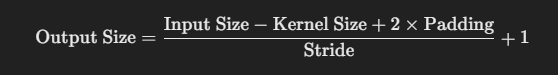
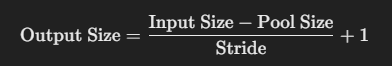
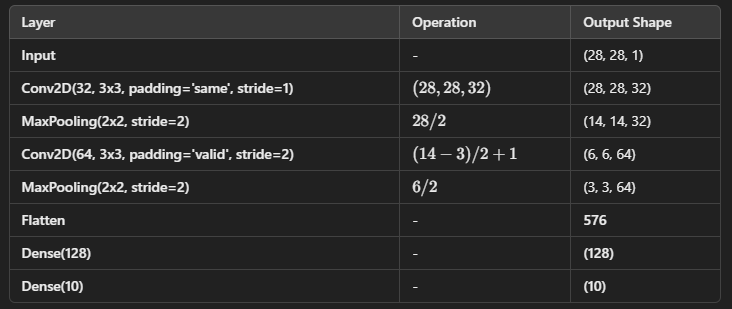

### **Tutorial: Training a Simple CNN on MNIST using TensorFlow**  

### **Objective:**  
In this tutorial, we will:  
✅ Load the **MNIST dataset** (handwritten digits 0-9)  
✅ Build a **simple CNN model** using TensorFlow  
✅ Train the CNN and evaluate its performance  
✅ Make predictions on test images  

---

## **Step 1: Install and Import Dependencies**  
We first need to install TensorFlow (if not already installed).  

```python
!pip install tensorflow
```

Now, import the necessary libraries:  

```python
import tensorflow as tf
from tensorflow import keras
import numpy as np
import matplotlib.pyplot as plt
```

---

## **Step 2: Load the MNIST Dataset**  
MNIST contains **70,000 images** of handwritten digits (28×28 pixels, grayscale).  

```python
# Load MNIST dataset
(x_train, y_train), (x_test, y_test) = keras.datasets.mnist.load_data()

# Normalize the images (convert pixel values from 0-255 to 0-1)
x_train, x_test = x_train / 255.0, x_test / 255.0
```

🎨 **Why Normalize?**  
It helps the CNN learn faster by keeping pixel values small.  

---

## **Step 3: Reshape Data for CNN Input**  
Since CNNs expect **3D input** (height, width, channels), we reshape the images:  

```python
# Reshape images to (28, 28, 1) - adding the channel dimension
x_train = x_train.reshape(-1, 28, 28, 1)
x_test = x_test.reshape(-1, 28, 28, 1)
```

---

## **Step 4: Build a Simple CNN Model**  
We will use:  
✅ **Conv2D** – To detect patterns (edges, shapes)  
✅ **MaxPooling2D** – To reduce size and keep important features  
✅ **Flatten** – Converts 2D data into 1D  
✅ **Dense (Fully Connected Layer)** – For classification  

```python
model = keras.Sequential([
    keras.layers.Conv2D(filters=32, kernel_size=(3, 3), activation='relu', input_shape=(28, 28, 1)),
    keras.layers.MaxPooling2D(pool_size=(2, 2)),
    
    keras.layers.Conv2D(filters=64, kernel_size=(3, 3), activation='relu'),
    keras.layers.MaxPooling2D(pool_size=(2, 2)),
    
    keras.layers.Flatten(),
    keras.layers.Dense(128, activation='relu'),
    keras.layers.Dense(10, activation='softmax')  # 10 output classes (digits 0-9)
])

# Compile the model
model.compile(optimizer='adam', loss='sparse_categorical_crossentropy', metrics=['accuracy'])
```

🎨 **Analogy:**  
- **Conv2D** is like your eyes detecting edges and shapes.  
- **MaxPooling** is like summarizing an image into key parts.  
- **Flatten** is like converting an image into a list of numbers.  
- **Dense Layers** are like the brain making decisions.  

---
## **Calculating the Ouput Shapes**

**Convolutional Layer Output**



**Max Pooling Output**



**Above Model's Each Layer output Shape**



---

## **Step 5: Train the CNN Model**  
Now, we train the CNN for **5 epochs** (passes over the dataset).  

```python
model.fit(x_train, y_train, epochs=5, validation_data=(x_test, y_test))
```

💡 **What is an epoch?**  
One epoch = training on all images **once**. More epochs = better learning.  

---

## **Step 6: Evaluate the Model**  
Let's check how well our CNN performs on unseen images.  

```python
test_loss, test_acc = model.evaluate(x_test, y_test)
print(f"\nTest accuracy: {test_acc:.4f}")
```

---

## **Step 7: Make Predictions**  
Now, let's test our CNN by predicting some images from the test set!  

```python
predictions = model.predict(x_test)

# Function to display predictions
def show_prediction(index):
    plt.imshow(x_test[index].reshape(28, 28), cmap='gray')
    plt.title(f"Predicted: {np.argmax(predictions[index])}, Actual: {y_test[index]}")
    plt.show()

# Show 5 random predictions
for i in [0, 10, 25, 50, 100]:  
    show_prediction(i)
```

🎨 **Analogy:**  
- CNN **"sees"** the image and **guesses** the digit.  
- We compare it with the actual digit to see if it's correct.  

---

## **Conclusion 🎯**  
✔ We built a **simple CNN** to classify handwritten digits.  
✔ We trained it using **MNIST dataset** and achieved high accuracy.  
✔ CNNs are **great at recognizing patterns** in images!  

---